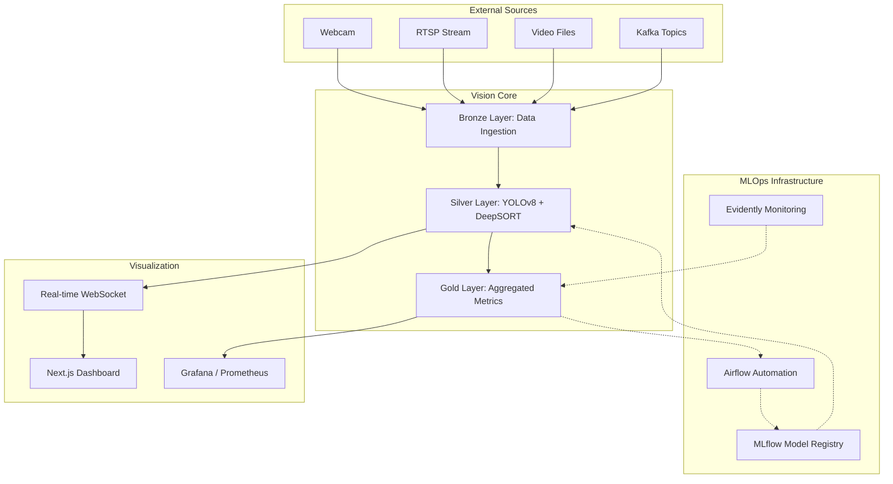
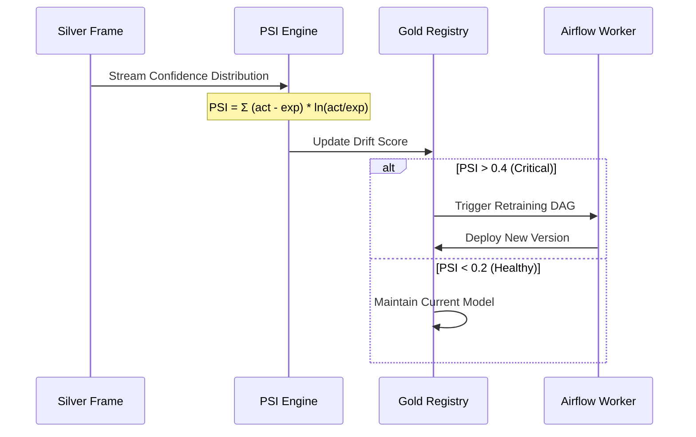
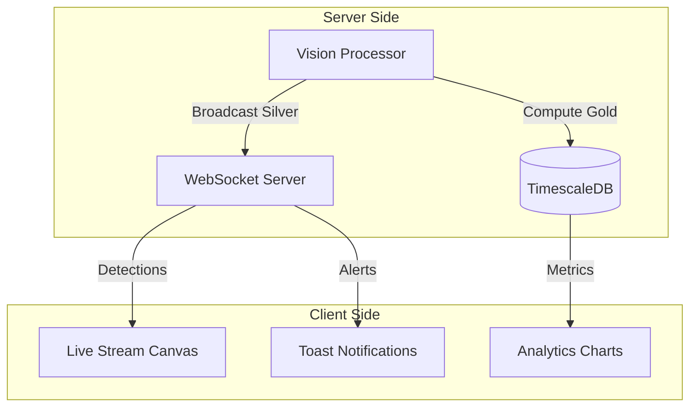
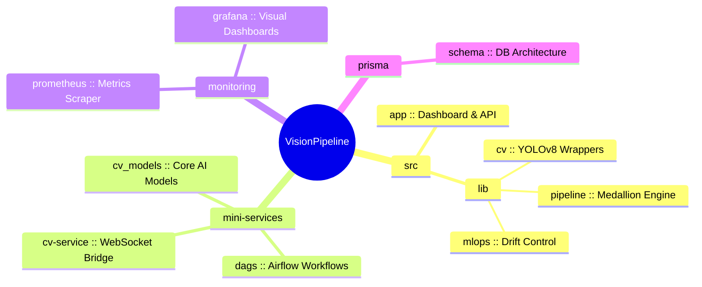

# VisionPipeline 

## System Overview



---

##  Data Engineering Pipeline (Medallion Architecture)

```mermaid
flowchart LR
    subgraph Bronze [Bronze Layer - RAW]
        direction TB
        B1[Raw Byte Streams]
        B2[Ingestion Timestamps]
        B3[Source Manifests]
    end

    subgraph Silver [Silver Layer - CLEANED]
        direction TB
        S1[YOLOv8 Objects]
        S2[DeepSORT Tracks]
        S3[Confidence Filtering]
    end

    subgraph Gold [Gold Layer - AGGREGATED]
        direction TB
        G1[Minute-by-minute KPIs]
        G2[PSI Drift Diagnostics]
        G3[Class Distribution]
    end

    Bronze -->|Validation| Silver
    Silver -->|Aggregation| Gold
```



---

##  Drift Detection & Model Lifecycle



---

##  Real-time Execution Flow



---

##  Repository Structure



---

##  Quick Start

```bash
# 1. Install dependencies
make install

# 2. Start full stack (Docker)
docker-compose up --build -d

# 3. Access Dashboard
open http://localhost:5173
```

---

## 🏗️ Architecture (ASCII)

```text
┌─────────────────────────────────────────────────────────────────────────────┐
│                           VisionPipeline (MLOps Core)                       │
├─────────────────────────────────────────────────────────────────────────────┤
│                                                                             │
│ [Sources]  ──▶ [BRONZE]  ──▶ [SILVER]  ──▶ [GOLD]  ──▶ [Visuals]            │
│   RTSP/URL       Raw Frame    Detections    Metrics      Grafana            │
│                  Ingestion    Tracking      Drift PSI    Dashboard          │
│                                                                             │
├─────────────────────────────────────────────────────────────────────────────┤
│                             MLOps Lifecycle                                 │
│                                                                             │
│ [Monitoring] ◀─▶ [MLflow Registry] ◀──▶ [Airflow DAG]                       │
│  Evidently         Model Versioning        Retraining Flow                  │
│  (Drift Score)                             (Audit >> Train >> Register)      │
│                                                                             │
└─────────────────────────────────────────────────────────────────────────────┘
```

---

## 📊 Medallion Pipeline Lifecycle

- **BRONZE (Raw)**: Captures the original source-of-truth frame bytes directly from ingestion.
- **SILVER (Cleaned)**: Refines detections through YOLOv8 and correlates IDs with DeepSORT.
- **GOLD (Aggregated)**: Computes high-level KPIs and PSI drift scores for business intelligence.

---

## ⚖️ License

**Copyright © 2025 Selma Haci. All rights reserved.**

This software and its associated documentation files are the proprietary property of **Selma Haci**. 

Unauthorized copying, modification, distribution, or use of this software, via any medium, is strictly prohibited without the express written permission of the copyright holder.
